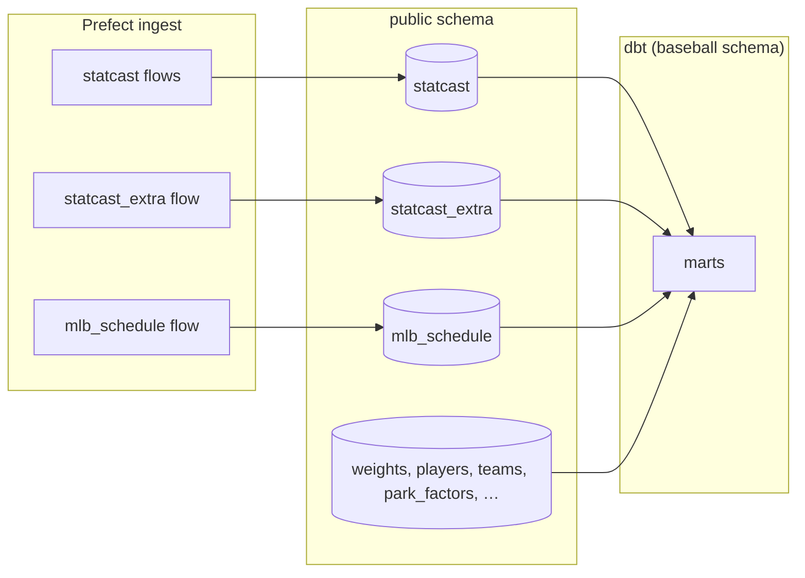
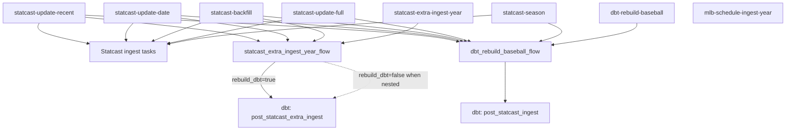
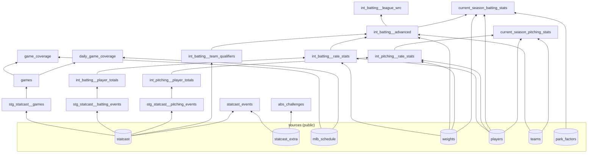

# Lineage (Prefect flows + dbt marts)

This repo has two orchestration layers:

1. **Prefect flows** load raw warehouse tables in Postgres (`public`).
2. **dbt** builds derived objects in the `baseball` schema from those sources.

There is no single auto-generated diagram for both layers. Use this doc for the static picture; use **dbt docs** and the **Prefect UI** for interactive, up-to-date views (see [Viewing lineage interactively](#viewing-lineage-interactively)).

Related: [orchestration.md](orchestration.md), [dbt.md](dbt.md).

## End-to-end picture



---

## Prefect flow call graph

Deployments are declared in [`prefect.yaml`](../prefect.yaml). Nested flows are invoked from Python in [`flows/`](../flows/); Prefect shows them as child runs in the UI.



When a parent Statcast flow calls `statcast_extra_ingest_year_flow`, it passes `rebuild_dbt=False` so dbt is not run twice. The parent then runs `dbt_rebuild_baseball_flow` with the full `post_statcast_ingest` selector.

### Deployments at a glance

| Deployment | Warehouse writes | Nested flows | dbt selector (if run) |
|------------|------------------|--------------|------------------------|
| `statcast-update-recent` | `statcast`, `statcast_extra` | extra → full dbt | `post_statcast_ingest` |
| `statcast-update-date` | `statcast`, `statcast_extra` | extra → full dbt | `post_statcast_ingest` |
| `statcast-backfill` | `statcast`, optional `statcast_extra` | extra (if dates filled) → full dbt | `post_statcast_ingest` |
| `statcast-extra-ingest-year` | `statcast_extra` | dbt when rows written | `post_statcast_extra_ingest` |
| `statcast-update-full` | `statcast` | full dbt only | `post_statcast_ingest` |
| `statcast-season` | `statcast` | full dbt only | `post_statcast_ingest` |
| `dbt-rebuild-baseball` | — | dbt only | `post_statcast_ingest` (default) |
| `mlb-schedule-ingest-year` | `mlb_schedule` | none | none (run dbt manually for coverage marts) |

dbt rebuilds are **skipped** when [`statcast_relevant_data_changed`](../etl_scripts/dbt_runner.py) reports no changes, unless `force=true` on `dbt-rebuild-baseball`.

---

## dbt model DAG

Models live under [`dbt/models/`](../dbt/models/). Marts default to `materialized_view` and tag `post_statcast_ingest` ([`dbt_project.yml`](../dbt_project.yml)). `statcast_events` and `abs_challenges` also carry tag `post_statcast_extra_ingest`.

### Sources → marts



### Selectors → models

Defined in [`selectors.yml`](../selectors.yml).

| Selector | Tag | Models |
|----------|-----|--------|
| `post_statcast_ingest` | `post_statcast_ingest` | All marts (default after Statcast ingest) |
| `post_statcast_extra_ingest` | `post_statcast_extra_ingest` | `statcast_events`, `abs_challenges` |

List models for a selector:

```bash
uv run dbt list --selector post_statcast_ingest --resource-type model
uv run dbt list --selector post_statcast_extra_ingest --resource-type model
```

Upstream of one mart:

```bash
uv run dbt list --select +statcast_events+ --resource-type model
```

---

## Viewing lineage interactively

### dbt (model dependencies)

Generates a browsable DAG from `ref()` / `source()` in the project:

```bash
uv run dbt docs generate
uv run dbt docs serve
```

Open the **Lineage** tab and click any node to expand upstream/downstream.

### Prefect (flow nesting)

For a specific run: Prefect UI → flow run → task/subflow tree. Nested flows (`statcast_extra_ingest_year_flow`, `dbt_rebuild_baseball_flow`) appear as child runs when a parent deployment triggers them.

Prefect does **not** produce a static repo-wide diagram of deployment relationships; those are only encoded in Python call sites under [`flows/`](../flows/).

---

## Keeping this doc accurate

Update this file when you:

- Add or rewire Prefect deployments or subflow calls in `flows/`.
- Add dbt models, sources, or selectors.
- Change which selector runs after which ingest.

For dbt, `dbt docs generate` always reflects the current model graph. For Prefect, the UI reflects actual run structure per deployment.
