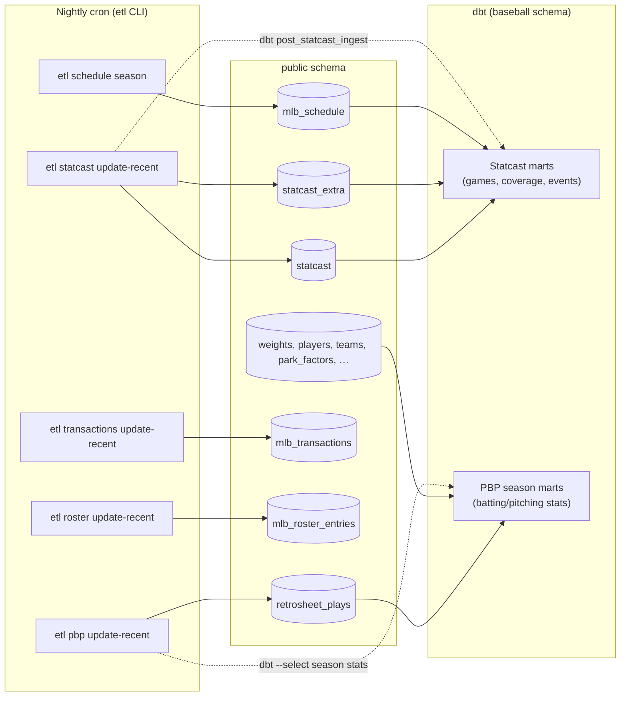
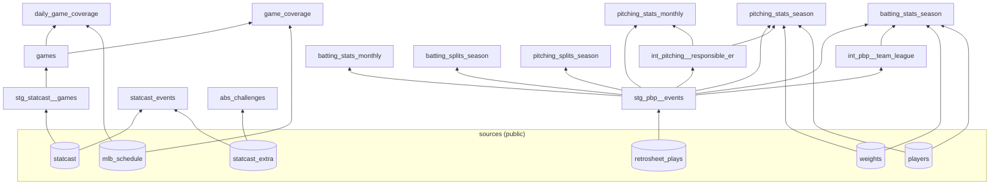

# Lineage (cron CLIs + dbt marts)

This repo has two layers:

1. **`etl` CLI jobs** (run nightly by cron) load raw warehouse tables in Postgres (`public`).
2. **dbt** builds derived objects in the `baseball` schema from those sources.

Use this doc for the static picture; use **dbt docs** for an interactive, up-to-date
model graph (see [Viewing lineage interactively](#viewing-lineage-interactively)).

Related: [dbt.md](dbt.md). Scheduling lives in [`crontab.sh`](../crontab.sh).

## End-to-end picture


```mermaid
flowchart LR
  subgraph cron["Nightly cron (etl CLI)"]
    SC["etl statcast update-recent"]
    SCH["etl schedule season"]
    PBP["etl pbp update-recent"]
    TX["etl transactions update-recent"]
    ROS["etl roster update-recent"]
  end

  subgraph public["public schema"]
    T1[(statcast)]
    T2[(statcast_extra)]
    T3[(mlb_schedule)]
    T4[(retrosheet_plays)]
    T5[(mlb_transactions)]
    T6[(mlb_roster_entries)]
    T7[(weights, players, teams, park_factors, …)]
  end

  subgraph dbt["dbt (baseball schema)"]
    MS["Statcast marts<br/>(games, coverage, events)"]
    MP["PBP season marts<br/>(batting/pitching stats)"]
  end

  SC --> T1
  SC --> T2
  SCH --> T3
  PBP --> T4
  TX --> T5
  ROS --> T6

  T1 --> MS
  T2 --> MS
  T3 --> MS
  T4 --> MP
  T7 --> MP

  SC -. dbt post_statcast_ingest .-> MS
  PBP -. dbt --select season stats .-> MP
```

After ingest, two CLIs trigger dbt themselves (no separate orchestrator):
`etl statcast update-recent` runs `dbt build --selector post_statcast_ingest`
(change-gated), and `etl pbp update-recent` runs the PBP season-stat models via
`run_mlbam_pbp_season_stats_dbt`. See [dbt.md](dbt.md#cli-integration-cron).

---

## dbt model DAG

Models live under [`dbt/models/`](../dbt/models/). Statcast coverage marts default to
`materialized_view` (`games` is a table) and carry tag `post_statcast_ingest`;
`statcast_events` / `abs_challenges` also carry tag `post_statcast_extra_ingest`.
PBP season marts are built by explicit `--select`, not by a tag.

### Sources → marts


```mermaid
flowchart BT
  subgraph sources["sources (public)"]
    statcast[(statcast)]
    extra[(statcast_extra)]
    schedule[(mlb_schedule)]
    plays[(retrosheet_plays)]
    weights[(weights)]
    players[(players)]
  end

  stg_games[stg_statcast__games]
  stg_pbp[stg_pbp__events]
  int_league[int_pbp__team_league]
  int_er[int_pitching__responsible_er]

  games[games]
  game_cov[game_coverage]
  daily_cov[daily_game_coverage]
  events[statcast_events]
  abs[abs_challenges]

  bat_season[batting_stats_season]
  pit_season[pitching_stats_season]
  bat_month[batting_stats_monthly]
  pit_month[pitching_stats_monthly]
  bat_split[batting_splits_season]
  pit_split[pitching_splits_season]

  statcast --> stg_games --> games
  games --> game_cov
  schedule --> game_cov
  games --> daily_cov
  schedule --> daily_cov
  statcast --> events
  extra --> events
  extra --> abs

  plays --> stg_pbp
  stg_pbp --> int_league
  stg_pbp --> int_er
  stg_pbp --> bat_season
  int_league --> bat_season
  stg_pbp --> pit_season
  int_er --> pit_season
  stg_pbp --> bat_month
  stg_pbp --> pit_month
  int_er --> pit_month
  stg_pbp --> bat_split
  stg_pbp --> pit_split
  weights --> bat_season
  weights --> pit_season
  players --> bat_season
  players --> pit_season
```

### Selectors → models

Defined in [`selectors.yml`](../selectors.yml).

| Selector / mechanism | What it builds |
|----------------------|----------------|
| `post_statcast_ingest` (tag, `parents: true`) | `games`, `game_coverage`, `daily_game_coverage`, `statcast_events`, `abs_challenges` (+ upstream). Run by `etl statcast update-recent`. |
| `post_statcast_extra_ingest` (tag) | `statcast_events`, `abs_challenges` |
| `MLBAM_PBP_SEASON_STATS_MODELS` (`--select`) | `stg_pbp__events`, `int_pitching__responsible_er`, `batting_stats_season`, `pitching_stats_season`. Run by `etl pbp update-recent`. |

List models for a selector:

```bash
uv run dbt list --selector post_statcast_ingest --resource-type model
```

Upstream of one mart:

```bash
uv run dbt list --select +pitching_stats_season+ --resource-type model
```

---

## Viewing lineage interactively

Generates a browsable DAG from `ref()` / `source()` in the project:

```bash
uv run dbt docs generate
uv run dbt docs serve
```

Open the **Lineage** tab and click any node to expand upstream/downstream.

---

## Keeping this doc accurate

Update this file when you:

- Add or rewire `etl` CLI ingest jobs in `etl_scripts/commands/` or `crontab.sh`.
- Add dbt models, sources, or selectors.
- Change which dbt models run after which ingest (`etl_scripts/dbt_runner.py`).

For dbt, `dbt docs generate` always reflects the current model graph.
